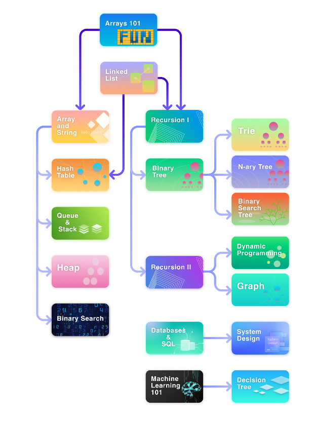

## SOLUTION TO THE LEETCODE PROBLEMS

---
### ROADMAP

---
### LEVELS

---

### Problems

  
1. Arrays 101

-  [485. Max Consecutive Ones](https://leetcode.com/problems/max-consecutive-ones/description/)
    - [C++](Arrays%20101/485.%20Max%20Consecutive%20Ones/find_max.cpp)
    - [Python](Arrays%20101/485.%20Max%20Consecutive%20Ones/find_max.py)

- [1295. Find Numbers with Even Number of Digits](https://leetcode.com/problems/find-numbers-with-even-number-of-digits/description/)
  - [C++](Arrays%20101/1295.%20Find%20Numbers%20with%20Even%20Number%20of%20Digits/find_numbers.cpp)
  - [Python](Arrays%20101/1295.%20Find%20Numbers%20with%20Even%20Number%20of%20Digits/find_numbers.py)

- [977. Squares of a Sorted Array](https://leetcode.com/problems/squares-of-a-sorted-array/description/)
  - [C++](Arrays%20101/977.%20Squares%20of%20a%20Sorted%20Array/sorted_squared_array.cpp)
  - [Python](Arrays%20101/977.%20Squares%20of%20a%20Sorted%20Array/sorted_squared_array.py)

- [1089. Duplicate Zeros](https://leetcode.com/problems/duplicate-zeros/description/)
  - [C++](Arrays%20101/1089.%20Duplicate%20Zeros/duplicate_zeros.cpp)
  - [Python](Arrays%20101/1089.%20Duplicate%20Zeros/duplicate_zeros.cpp)

- [88. Merge Sorted Array](https://leetcode.com/problems/merge-sorted-array/description/)
  - [C++](Arrays%20101/88.%20Merge%20Sorted%20Array/merge.cpp)
  - [Python](Arrays%20101/88.%20Merge%20Sorted%20Array/merge.py)

- [27. Remove Element](https://leetcode.com/problems/remove-element/description/)
  - [C++](Arrays%20101/27.%20Remove%20Element/remove_element.cpp)
  - [Python](Arrays%20101/27.%20Remove%20Element/remove_element.py)

- [26. Remove Duplicates from Sorted Array](https://leetcode.com/problems/remove-duplicates-from-sorted-array/description/)
  - [C++](Arrays%20101/26.%20Remove%20Duplicates%20from%20Sorted%20Array/remove_duplicates.cpp)
  - [Python](Arrays%20101/26.%20Remove%20Duplicates%20from%20Sorted%20Array/remove_duplicates.py)

- [1346. Check If N and Its Double Exist](https://leetcode.com/problems/check-if-n-and-its-double-exist/)
  - [C++](Arrays%20101/1346.%20Check%20If%20N%20and%20Its%20Double%20Exist/check.cpp)
  - [Python](Arrays%20101/1346.%20Check%20If%20N%20and%20Its%20Double%20Exist/check.py)
  
- [941. Valid Mountain Array](https://leetcode.com/problems/valid-mountain-array/)
  - [C++](Arrays%20101/941.%20Valid%20Mountain%20Array/valid_mountain.cpp)
  - [Python](Arrays%20101/941.%20Valid%20Mountain%20Array/valid_mountain.py)

- [1299. Replace Elements with Greatest Element on Right Side](https://leetcode.com/problems/replace-elements-with-greatest-element-on-right-side/)
  - [C++](Arrays%20101/1299.%20Replace%20Elements%20with%20Greatest%20Element%20on%20Right%20Side/replace_element.cpp)
  - [Python](Arrays%20101/1299.%20Replace%20Elements%20with%20Greatest%20Element%20on%20Right%20Side/replace_element.py)
  
- [283. Move Zeros](https://leetcode.com/problems/move-zeroes/)
  - [C++](Arrays%20101/283.%20Move%20Zeros/move_zeros.cpp)
  - [Python](Arrays%20101/283.%20Move%20Zeros/move_zeros.py)  

- [905. Sort Array By Parity](https://leetcode.com/problems/sort-array-by-parity/)
  - [C++](Arrays%20101/905.%20Sort%20Array%20By%20Parity/sortbyparity.cpp)
  - [Python](Arrays%20101/905.%20Sort%20Array%20By%20Parity/sortbyparity.cpp)

- [1051. Height Checker](https://leetcode.com/problems/height-checker/)
  - [C++](Arrays%20101/1051.%20Height%20Checker/checkheight.cpp)
  - [Python](Arrays%20101/1051.%20Height%20Checker/checkheight.py)

- [414. Third Maximum Number](https://leetcode.com/problems/third-maximum-number/description/)
  - [C++](Arrays%20101/414.%20Third%20Maximum%20Number/third_max.cpp)
  - [Python](Arrays%20101/414.%20Third%20Maximum%20Number/third_max.py)

- [448. Find All Numbers Disappeared in an Array](https://leetcode.com/problems/find-all-numbers-disappeared-in-an-array/description/)
  - [C++](Arrays%20101/448.%20Find%20All%20Numbers%20Disappeared%20in%20an%20Array/findall.cpp)
  - [Python](Arrays%20101/448.%20Find%20All%20Numbers%20Disappeared%20in%20an%20Array/findall.py)

2. Linked List

- [707. Design Linked List](https://leetcode.com/problems/design-linked-list/description/)
  - [C++](Linked%20List/707.%20Design%20Linked%20List/linked_list.cpp)
  - [Python](Linked%20List/707.%20Design%20Linked%20List/linked_list.py)

- [141. Linked List Cycle](https://leetcode.com/problems/linked-list-cycle/description/)
  - [C++](Linked%20List/141.%20Linked%20List%20Cycle/check_loop.cpp)
  - [Python](Linked%20List/141.%20Linked%20List%20Cycle/check_loop.py)

- [142. Linked List Cycle II](https://leetcode.com/problems/linked-list-cycle-ii/description/)
  - [C++](Linked%20List/142.%20Linked%20List%20Cycle%20II/get_cycle.cpp)
  - [Python](Linked%20List/142.%20Linked%20List%20Cycle%20II/get_cycle.py)

- [160. Intersection of Two Linked Lists](https://leetcode.com/problems/intersection-of-two-linked-lists/description/)
  - [C++](Linked%20List/160.%20Intersection%20of%20Two%20Linked%20List/chech_intersections.cpp)
  - [Python](Linked%20List/160.%20Intersection%20of%20Two%20Linked%20List/chech_intersections.py)

- [19. Remove Nth Node From End of List](https://leetcode.com/problems/remove-nth-node-from-end-of-list/description/)
  - [C++](Linked%20List/19.%20Remove%20Nth%20Node%20From%20End%20of%20List/remove_element.cpp)
  - [Python](Linked%20List/19.%20Remove%20Nth%20Node%20From%20End%20of%20List/remove_element.py)

- [206. Reverse Linked List](https://leetcode.com/problems/reverse-linked-list/description/)
  - [C++](Linked%20List/206.%20Reverse%20Linked%20List/reverse.cpp)
  - [Python](Linked%20List/206.%20Reverse%20Linked%20List/reverse.py)

- [203. Remove Linked List Elements](https://leetcode.com/problems/remove-linked-list-elements/description/)
  - [C++](Linked%20List/203.%20Remove%20Linked%20List%20Elements/remove_element.cpp)
  - [Python](Linked%20List/203.%20Remove%20Linked%20List%20Elements/remove_element.py)

- [328. Odd Even Linked List](https://leetcode.com/problems/odd-even-linked-list/description/)
  - [C++](Linked%20List/%20328.%20Odd%20Even%20Linked%20List/odd_even.cpp)
  - [Python](Linked%20List/%20328.%20Odd%20Even%20Linked%20List/odd_even.py)

- [21. Merge Two Sorted Lists](https://leetcode.com/problems/merge-two-sorted-lists/description/)
  - [C++](Linked%20List/21.%20Merge%20Two%20Sorted%20Lists/merge.cpp)
  - [Python](Linked%20List/21.%20Merge%20Two%20Sorted%20Lists/merge.py)

- [2. Add Two Numbers](https://leetcode.com/problems/add-two-numbers/)
  - [C++](Linked%20List/2.%20Add%20Two%20Numbers/add.cpp)
  - [Python](Linked%20List/2.%20Add%20Two%20Numbers/add.py)

- [430. Flatten a Multilevel Doubly Linked List](https://leetcode.com/problems/flatten-a-multilevel-doubly-linked-list/description/)
  - [C++](Linked%20List/430.%20Flatten%20a%20Multilevel%20Doubly%20Linked%20List/flatten.cpp)
  - [Python](Linked%20List/430.%20Flatten%20a%20Multilevel%20Doubly%20Linked%20List/flatten.py)

- [138. Copy List with Random Pointer](https://leetcode.com/problems/copy-list-with-random-pointer/)
  - [C++](Linked%20List/138.%20Copy%20List%20with%20Random%20Pointer/copy_list.cpp)
  - [Python](Linked%20List/138.%20Copy%20List%20with%20Random%20Pointer/copy_list.py)

- [61. Rotate List](https://leetcode.com/problems/rotate-list/description/)
  - [C++](Linked%20List/61.%20Rotate%20List/rotate.cpp)
  - [Python](Linked%20List/61.%20Rotate%20List/rotate.py)

3. Arrays and String

- [724. Find Pivot Index](https://leetcode.com/problems/find-pivot-index/description/)
  - [C++](Arrays%20and%20String/724.%20Find%20Pivot%20Index/find_pivot_index.cpp)
  - [Python](Arrays%20and%20String/724.%20Find%20Pivot%20Index/find_pivot_index.py)

- [747. Largest Number At Least Twice of Others](https://leetcode.com/problems/largest-number-at-least-twice-of-others/description/)
  - [C++](Arrays%20and%20String/747.%20Largest%20Number%20At%20Least%20Twice%20of%20Others/find_max.cpp)
  - [Python](Arrays%20and%20String/747.%20Largest%20Number%20At%20Least%20Twice%20of%20Others/find_max.py)

- [66. Plus One](https://leetcode.com/problems/plus-one/description/)
  - [C++](Arrays%20and%20String/66.%20Plus%20One/plus_one.cpp)
  - [Python](Arrays%20and%20String/66.%20Plus%20One/plus_one.py)

- [498. Diagonal Traverse](https://leetcode.com/problems/diagonal-traverse/description/)
  - [C++](Arrays%20and%20String/498.%20Diagonal%20Traverse/traverse.cpp)
  - [Python](Arrays%20and%20String/498.%20Diagonal%20Traverse/traverse.py)

- [57. Spiral Matrix](https://leetcode.com/problems/spiral-matrix/description/)
  - [C++](Arrays%20and%20String/54.%20Spiral%20Matrix/spiral.cpp)
  - [Python](Arrays%20and%20String/54.%20Spiral%20Matrix/spiral.py)

- [118. Pascal's Triangle](https://leetcode.com/problems/pascals-triangle/description/)
  - [C++](Arrays%20and%20String/118.%20Pascal's%20Triangle/pascal.cpp)
  - [Python](Arrays%20and%20String/118.%20Pascal's%20Triangle/pascal.py)
  
- [67. Add Binary](https://leetcode.com/problems/add-binary/description/)
  - [C++](Arrays%20and%20String/67.%20Add%20Binary/add.cpp)
  - [Python](Arrays%20and%20String/67.%20Add%20Binary/add.py)
  
- [28. Find the Index of the First Occurence of a String](https://leetcode.com/problems/find-the-index-of-the-first-occurrence-in-a-string/description/)
  - [C++](Arrays%20and%20String/28.%20Find%20the%20Index%20of%20the%20First%20Occurence%20of%20a%20String/first_occurence.cpp)
  - [Python](Arrays%20and%20String/28.%20Find%20the%20Index%20of%20the%20First%20Occurence%20of%20a%20String/first_occurence.py)
  
- [14. Longest Common Prefix](https://leetcode.com/problems/longest-common-prefix/description/)
  - [C++](Arrays%20and%20String/14.%20Longest%20Common%20Prefix/prefix.cpp)
  - [Python](Arrays%20and%20String/14.%20Longest%20Common%20Prefix/prefix.py)
  
- [344. Reverse String](https://leetcode.com/problems/reverse-string/description/)
  - [C++](https://github.com/shank885/Leetcode/blob/main/Arrays%20and%20String/344.%20Reverse%20String/reverse.cpp)
  - [Python](https://github.com/shank885/Leetcode/blob/main/Arrays%20and%20String/344.%20Reverse%20String/reverse.py)

- [561. Array Partition](https://leetcode.com/problems/array-partition/description/)
  - [C++](Arrays%20and%20String/561.%20Array%20Partition/minmax.cpp)
  - [Python](Arrays%20and%20String/561.%20Array%20Partition/minmax.py)

- [167. Two Sum II - Input Array Is Sorted](https://leetcode.com/problems/two-sum-ii-input-array-is-sorted/description/)
  - [C++](Arrays%20and%20String/167.%20Two%20Sum%20II%20-%20Input%20Array%20Is%20Sorted/two_sum.cpp)
  - [Python](Arrays%20and%20String/167.%20Two%20Sum%20II%20-%20Input%20Array%20Is%20Sorted/two_sum.py)

- [27. Remove Element](https://leetcode.com/problems/remove-element/description/)
  - [C++](Arrays%20and%20String/27.%20Remove%20Element/remove_element.cpp)
  - [Python](Arrays%20and%20String/27.%20Remove%20Element/remove_element.py)

- [485. Max Consecutive Ones](https://leetcode.com/problems/max-consecutive-ones/description/)
  - [C++](Arrays%20and%20String/485.%20Max%20Consecutive%20Ones/max_consecutive.cpp)
  - [Python](Arrays%20and%20String/485.%20Max%20Consecutive%20Ones/max_consecutive.py)

- [Minimum Size Subarray Sum](https://leetcode.com/problems/minimum-size-subarray-sum/description/)
  - [C++](Arrays%20and%20String/209.%20Minimum%20Size%20Subarray%20Sum/min_subarray.cpp)
  - [Python](Arrays%20and%20String/209.%20Minimum%20Size%20Subarray%20Sum/min_subarray.py)

- [189. Rotate Array](https://leetcode.com/problems/rotate-array/description/)
  - [C++](Arrays%20and%20String/189.%20Rotate%20Array/rotate_right.cpp)
  - [Python](Arrays%20and%20String/189.%20Rotate%20Array/rotate_right.py)

- [119. Pascal's Triangle II](https://leetcode.com/problems/pascals-triangle-ii/description/)
  - [C++](Arrays%20and%20String/119.%20Pascal's%20Triangle%20II/pascal.cpp)
  - [Python](Arrays%20and%20String/119.%20Pascal's%20Triangle%20II/pascal.py)

- [151. Reverse Words in a String](https://leetcode.com/problems/reverse-words-in-a-string/description/)
  - [C++](Arrays%20and%20String/151.%20Reverse%20Words%20in%20a%20String/reverse.cpp)
  - [Python](Arrays%20and%20String/151.%20Reverse%20Words%20in%20a%20String/reverse.py)

- [557. Reverse Words in a String III](https://leetcode.com/problems/reverse-words-in-a-string-iii/description/)
  - [C++](Arrays%20and%20String/557.%20Reverse%20Words%20in%20a%20String%20III/reverse.cpp)
  - [Python](Arrays%20and%20String/557.%20Reverse%20Words%20in%20a%20String%20III/reverse.py)

- [26. Remove Duplicates from Sorted Array](https://leetcode.com/problems/remove-duplicates-from-sorted-array/description/)
  - [C++](Arrays%20and%20String/26.%20Remove%20Duplicates%20from%20Sorted%20Array/remove_duplicates.cpp)
  - [Python](Arrays%20and%20String/26.%20Remove%20Duplicates%20from%20Sorted%20Array/remove_duplicates.py)

- [283. Move Zeroes](https://leetcode.com/problems/move-zeroes/description/)
  - [C++](Arrays%20and%20String/283.%20Move%20Zeroes/move_zeros.cpp)
  - [Python](Arrays%20and%20String/283.%20Move%20Zeroes/move_zeros.py)

4. Hash Table

- [705. Define HashSet](https://leetcode.com/problems/design-hashset/description/)
  - [C++](Hash%20Table/705.%20Define%20HashSet/hash_set.cpp)
  - [Python](Hash%20Table/705.%20Define%20HashSet/hash_set.py)

- [706. Define HashMap](https://leetcode.com/problems/design-hashmap/description/)
  - [C++](Hash%20Table/706.%20Define%20HashMap/hashmap.cpp)
  - [Python](Hash%20Table/706.%20Define%20HashMap/hashmap.py)

- [217. Contains Duplicate](https://leetcode.com/problems/contains-duplicate/description/)
  - [C++](Hash%20Table/217.%20Contains%20Duplicate/has_duplicate.cpp)
  - [Python](Hash%20Table/217.%20Contains%20Duplicate/has_duplicate.py)

- [136. Single Number](https://leetcode.com/problems/single-number/)
  - [C++](Hash%20Table/136.%20Single%20Number/single_number.cpp)
  - [Python](Hash%20Table/136.%20Single%20Number/single_number.py)

- [349. Intersection of Two Arrays](https://leetcode.com/problems/intersection-of-two-arrays/description/)
  - [C++](Hash%20Table/349.%20Intersection%20of%20Two%20Arrays/intersection.cpp)
  - [Python](Hash%20Table/349.%20Intersection%20of%20Two%20Arrays/intersection.cpp)

- [202. Happy Number](https://leetcode.com/problems/happy-number/description/)
  - [C++](Hash%20Table/202.%20Happy%20Number/happy.cpp)
  - [Python](Hash%20Table/202.%20Happy%20Number/happy.py)

- [1. Two Sum](https://leetcode.com/problems/two-sum/description/)
  - [C++]()
  - [Python]()

- 
  - [C++]()
  - [Python]()

- 
  - [C++]()
  - [Python]()

5. Recursion

- 
  - [C++]()
  - [Python]()

6. Queue & Stack

- 
  - [C++]()
  - [Python]()

7. Heap

- 
  - [C++]()
  - [Python]()

8. Binary Search

- 
  - [C++]()
  - [Python]()

9. Binary Tree

- 
  - [C++]()
  - [Python]()

10. Binary Search Tree

- 
  - [C++]()
  - [Python]()

11. Trie

- 
  - [C++]()
  - [Python]()

12. N-ary Tree

- 
  - [C++]()
  - [Python]()

13. Recursion II

- 
  - [C++]()
  - [Python]()

14. Dynamic Programming

- 
  - [C++]()
  - [Python]()

15. Graph

- 
  - [C++]()
  - [Python]()

---

---

- [1. Two Sum]()
  - [C++]()
  - [Python]()
- [383. Ransom Note]()
  - [C++]()
  - [Python]()
- [412. Fizz Buzz]()
  - [C++]()
  - [Python]()
- [876. Middle of the Linked List]()
  - [C++]()
  - [Python]()
- [1342. Number of Steps to Reduce a Number to Zero]()
  - [C++]()
  - [Python]()
- [1480. Running Sum of 1d Array]()
  - [C++]()
  - [Python]()
- [1672. Richest Customer Wealth]()
  - [C++]()
  - [Python]()

